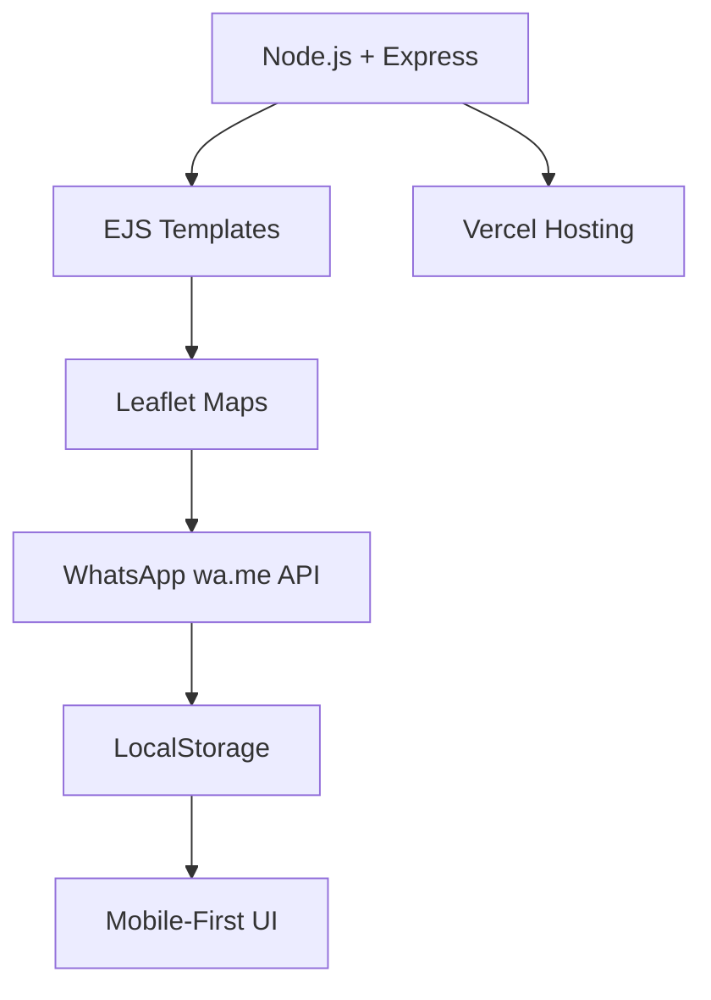

# Portal Ecoponto Leme-SP 🚀

[](https://vercel.com/new/clone?repository=https%3A%2F%2Fgithub.com%2FGabrielHTuratti%2Fleme-ecoponto)

**Portal web mobile-first para gestão ambiental da cidade de Leme/SP**  
Facilita denúncias de problemas ambientais (com foto), consulta ao ecoponto oficial e cronograma de coleta de lixo.

## ✨ **Funcionalidades**

| Funcionalidade | Descrição |
|---------------|-----------|
| 📍 **Mapa Interativo** | Localização exata do Ecoponto Ribeirão do Meio (Leaflet + OpenStreetMap) |
| 🗑️ **Cronograma de Coleta** | Dias oficiais por bairro (dados da Prefeitura de Leme) |
| 📱 **Denúncias Rápidas** | Formulário com validação (mín. 20 palavras) + envio direto pro WhatsApp da Ouvidoria |
| 📸 **Fotos** | Preview + salvamento local + orientação pro WhatsApp Web |
| 💾 **Galeria Local** | Histórico de denúncias salvas no navegador (LocalStorage) |
| 📊 **Mobile-First** | 100% responsivo, otimizado pra celular |

## 🎯 **Impacto Social**

- **ODS 11**: Cidades e Comunidades Sustentáveis
- **ODS 12**: Consumo e Produção Responsáveis (Meta 12.5)
- **Testado com moradores** de diferentes bairros
- **100% sucesso** no envio de denúncias

## 🚀 **Como Usar**

### 🔧 **Instalação Local**

```bash
# Clona o repositório
git clone https://github.com/GabrielHTuratti/leme-ecoponto.git
cd leme-ecoponto

# Instala dependências
npm install

# Roda localmente
npm start
```

Abre [http://localhost:3000](http://localhost:3000)

### 🌐 **Deploy Instantâneo**

1. Clique no botão **[Deploy na Vercel](#)** acima
2. Conecte seu GitHub
3. **Pronto!** Portal online em 60 segundos

### 📱 **Teste no Celular**

1. Acessa o link deployado
2. Preenche o formulário
3. Tira foto do problema
4. **Clica "Enviar"** → WhatsApp abre automaticamente

## 🛠 **Tecnologias**



| Frontend | Backend | Infra |
|----------|---------|-------|
| HTML5, CSS3, Vanilla JS | Node.js, Express | Vercel |
| Leaflet.js | EJS | LocalStorage |

## 📋 **Estrutura do Projeto**

```
leme-ecoponto/
├── server.js          # Express server
├── src/
│   └── views/
│   │   └── index.ejs      # Template principal
├── public/
│   ├── css/
│   │   └── style.css  # Estilos mobile-first
│   └── js/
│       └── main.js    # Lógica + validações
├── package.json       # Dependências
```

## 🎨 **Prints**

| Tela Inicial | Cronograma | Formulário Denúncia |
|--------------|-------------------|---------------|
|  |  |  |

## 📊 **Validações Implementadas**

```js
// Mínimo 10 palavras na descrição
const palavras = desc.split(/\s+/).filter(p => p.length > 0);
if (palavras.length < 10) {
  toast(`Faltam detalhes! Só ${palavras.length} palavras. Mínimo: 10`, 'warn');
  return;
}
```

## 👥 **Feedback dos Usuários**

> "Ajuda na facilidade das denúncias"  
> *— Maria, Bairro Centro*

> "Agora sei o dia e o horário certo da coleta no meu bairro"  
> *— João, Bairro Novo Horizonte*

## 🤝 **Contribuições**

1. Fork o projeto
2. Crie sua branch (`git checkout -b feature/nova-funcionalidade`)
3. Commit suas mudanças (`git commit -m 'Adiciona X'`)
4. Push para a branch (`git push origin feature/nova-funcionalidade`)
5. Abra um Pull Request

## 🙏 **Agradecimentos**

- **Prefeitura de Leme/SP** - Dados oficiais
- **Moradores de Leme** - Testes e feedback
- **Anhanguera** - Oportunidade de extensão
- **Vercel** - Hospedagem gratuita

## 🔗 **Links Úteis**

- [Portal Online](https://portal-ecoponto-leme.vercel.app/)
- [Código Fonte](https://github.com/GabrielHTuratti/leme-ecoponto)
- [Prefeitura Leme](https://www.leme.sp.gov.br)
---

**Feito com ❤️ por [Gabriel Turatti](https://github.com/GabrielHTuratti) para a comunidade de Leme/SP**

<div align="center">
  
  
  
</div>

---

**⭐ Star este repositório se ajudou sua cidade!**
